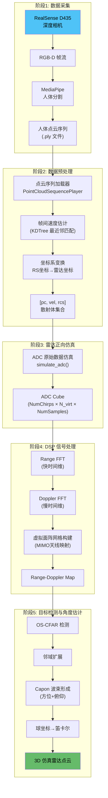
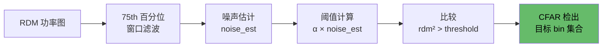

# 毫米波雷达人体点云仿真算法流程详解

## 项目总览

本项目实现了一套**基于 RealSense 深度相机数据驱动的毫米波 FMCW 雷达人体回波仿真系统**。其核心思路是：

> 用 RealSense D435 深度相机采集真实人体 3D 点云 → 将其作为雷达散射体输入 → 仿真 FMCW 雷达 ADC 原始数据 → 经完整 DSP 链路处理 → 提取仿真雷达点云

---

## 系统架构总览



---

## 阶段 1：数据采集

### 涉及文件
- [realsense.py](file:///c:/OrangeFiles/科研/Realsense/reconstruction/src/utils/realsense.py) — RealSense 处理器核心
- [pcdRebuild.py](file:///c:/OrangeFiles/科研/Realsense/reconstruction/src/pcdRebuild.py) — 实时 3D 可视化 UI
- [collect_human_pcd.py](file:///c:/OrangeFiles/科研/Realsense/reconstruction/src/collect_human_pcd.py) — 点云序列采集 UI

### 流程

1. **RealSense D435 帧获取**：通过 `pyrealsense2` 打开 RGB + Depth 双流，分辨率默认配置在 [rs_config.py](file:///c:/OrangeFiles/科研/Realsense/reconstruction/src/utils/rs_config.py) 中
2. **深度滤波**：依次施加 Spatial Filter → Temporal Filter → Hole Filling Filter，减少深度噪声
3. **人体语义分割**：使用 MediaPipe Pose Landmarker (Heavy 模型) 推理，输出二值分割掩码 (`segmentation_mask`) 以区分人体前景与背景
4. **关键点提取**：同时检测 Pose (33 关节)、Hand (21 节点×2)、Face (468 节点) 的 2D 关键点，并通过 `rs2_deproject_pixel_to_point()` 反投影到 3D 空间
5. **点云生成**：用分割掩码过滤深度图 → RGBD → Open3D 点云，体素降采样后输出
6. **序列录制**：[collect_human_pcd.py](file:///c:/OrangeFiles/%E7%A7%91%E7%A0%94/Realsense/reconstruction/src/collect_human_pcd.py) 将每帧人体点云按 `frame_XXXX.ply` 命名存入序列目录

---

## 阶段 2：数据预处理

### 涉及文件
- [seq_loader.py](file:///c:/OrangeFiles/科研/Realsense/reconstruction/src/utils/seq_loader.py) — 点云序列加载与速度估计
- [radar_generate.py](file:///c:/OrangeFiles/科研/Realsense/reconstruction/src/radar_generate.py) — 主管线 (坐标变换部分)

### 2.1 点云序列加载

[PointCloudSequencePlayer](file:///c:/OrangeFiles/%E7%A7%91%E7%A0%94/Realsense/reconstruction/src/utils/seq_loader.py#17-146) 从磁盘读取排序后的 `.ply` 文件序列：

```python
player = PointCloudSequencePlayer(seq_path, fps=6.0)
pc, vel, rcs = player.get_all_as_radar_targets(frame_idx=50)
```

### 2.2 帧间速度估计

利用 **KDTree 最近邻匹配** 计算帧间速度：

```
velocity = (当前帧点位置 - 上一帧最近邻点位置) / dt
```

- 使用 `scipy.spatial.cKDTree` 批量查询最近邻
- 距离超过 0.5m 的匹配视为无效（静止处理）
- 对第 0 帧特殊处理：借用第 0→1 帧的速度作为初始速度

### 2.3 坐标系变换

RealSense 和雷达使用不同的坐标约定：

| 方向 | RealSense 坐标系 | 雷达坐标系 |
|------|-----------------|-----------|
| 水平 | X → 右 | X → 右 (方位) |
| 纵深 | Z → 前 | Y → 前 (深度) |
| 垂直 | Y → **下** | Z → **上** (俯仰) |

变换公式：
```python
radar_X = rs_X        # 水平不变
radar_Y = rs_Z        # 深度轴映射
radar_Z = -rs_Y       # 垂直轴翻转
```

可选的**俯仰角补偿**通过绕 X 轴的旋转矩阵实现（当前设置 0°）。

### 2.4 RCS 赋值

每个点被赋予恒定 RCS = 0.1 m²，并叠加 ±20% 的随机扰动模拟散射面粗糙度差异。

---

## 阶段 3：雷达正向仿真（ADC 生成）

### 涉及文件
- [radar_config.py](file:///c:/OrangeFiles/科研/Realsense/reconstruction/src/utils/radar_config.py) — 雷达参数配置
- [radar_dsp.py → simulate_adc()](file:///c:/OrangeFiles/科研/Realsense/reconstruction/src/utils/radar_dsp.py#L16-L92) — ADC 仿真核心

### 3.1 雷达系统参数

| 参数 | 值 | 说明 |
|------|-----|------|
| 载波频率 f_c | 61.5 GHz | V-Band 毫米波 |
| 扫频带宽 B | 6 GHz | 距离分辨率 ≈ 2.5 cm |
| 调频斜率 K | 75 THz/s | |
| Chirp 周期 T_c | 80 μs | |
| PRT | 100 μs | 脉冲重复时间 |
| 采样率 F_s | 10 MHz | |
| 快时间采样点 | 128 | |
| 慢时间 Chirp 数 | 128 | |
| Tx 天线 | 4 个 | 不规则面阵排布 |
| Rx 天线 | 4 个 | 均匀线阵 (X方向, d间隔) |
| MIMO 模式 | TDM | 产生 16 根虚拟天线 |

### 3.2 天线阵列配置

```
                    4d
    TX1 ─────────── TX2 ─── TX3 ─── TX4
    (0,0,0)      (4d,0,0) (4d,0,d) (4d,0,2d)

    RX1  RX2  RX3  RX4
   (0,0,3d)(d,0,3d)(2d,0,3d)(3d,0,3d)
```

通过 TDM-MIMO 产生 4×4=16 根虚拟天线，在水平 (X) 和垂直 (Z) 方向都有孔径，可以同时估计方位角和俯仰角。

### 3.3 ADC 信号生成算法

对每个散射点 p，ADC 仿真计算以下步骤：

> [!IMPORTANT]
> **分批矩阵化** (`batch_size=50`)：为避免内存爆炸，将数千个点分批处理，每批内使用 NumPy 广播进行矢量化运算。

**① 动态位置计算**

散射点随时间运动：
$$\text{pos}(t) = \text{pos}_0 + \text{vel} \times t_{\text{slow}}$$

**② 双程距离计算**

对每个虚拟天线（Tx-Rx 组合），计算发射和接收路径：
$$R_{tx} = \|\text{pos}(t) - \text{Tx}_i\|, \quad R_{rx} = \|\text{pos}(t) - \text{Rx}_j\|$$

**③ 飞行时间**
$$\tau = (R_{tx} + R_{rx}) / c$$

**④ IF 信号相位**：FMCW 差频信号的相位模型
$$\phi = 2\pi (f_c \cdot \tau + K \cdot \tau \cdot t_{\text{fast}})$$

**⑤ 幅值衰减**：采用 **1/R² 软化模型**（而非理论 1/R⁴），因为近距离 (1-3m) 人体场景中 R⁴ 动态范围过大会导致弱散射点被掩盖
$$A = \sqrt{\text{RCS}} / (R_{tx} \cdot R_{rx})$$

**⑥ 信号叠加**：所有散射点的 IF 信号线性叠加到 ADC 立方体中
$$\text{adc\_cube} = \sum_{p} A_p \cdot e^{j\phi_p}$$

### 3.4 噪声模型

1. **高斯白噪声**：基于信号平均功率设置 20dB SNR 的加性复高斯噪声
2. **VCO 相位噪声**：1° 标准差的乘性相位随机扰动

**输出**：`adc_cube` → shape [(128, 16, 128)](file:///c:/OrangeFiles/%E7%A7%91%E7%A0%94/Realsense/reconstruction/src/pcdRebuild.py#375-377) 即 [(NumChirps, N_virt, NumSamples)](file:///c:/OrangeFiles/%E7%A7%91%E7%A0%94/Realsense/reconstruction/src/pcdRebuild.py#375-377)

---

## 阶段 4：DSP 信号处理链路

### 涉及文件
- [radar_dsp.py → process_radar_data()](file:///c:/OrangeFiles/科研/Realsense/reconstruction/src/utils/radar_dsp.py#L94-L172) — DSP 链路

### 4.1 距离域 FFT (Range FFT)

```python
win_range = hanning(128)                    # Hanning 窗抑制旁瓣
range_fft = FFT(adc_cube * win, axis=快时间) # 沿采样点维度做 FFT
range_fft = range_fft[:, :, :64]            # 截取正频率部分
```

- 每个频率 bin 对应一个距离：`range = freq × c / (2K)`
- 距离分辨率：`Δr = c / (2B) ≈ 0.025 m`

### 4.2 多普勒域 FFT (Doppler FFT)

```python
win_doppler = hanning(128)                   # Hanning 窗
doppler_fft = fftshift(FFT(range_fft * win, axis=慢时间))
```

- 沿 Chirp 维度做 FFT → 提取多普勒频移 → 径向速度
- 速度分辨率：`Δv = λ / (2 × NumChirps × PRT) ≈ 0.019 m/s`

### 4.3 虚拟面阵网格构建

将 16 根虚拟天线的频域数据映射到 2D 天线平面网格上：

```python
# 虚拟天线位置 = TxPos + RxPos (归一化到 d=λ/2 单位)
grid[chirp, vz, vx, range_bin] = doppler_fft[chirp, virt_idx, range_bin]
```

- 动态计算网格尺寸以适应不规则阵列
- `grid_mask` 记录哪些网格位置有真实天线填充（稀疏阵列处理）
- 识别**方位方向阵元** (水平行) 和**俯仰方向阵元** (纵向列) 用于后续 Capon

### 4.4 Range-Doppler Map (RDM)

```python
rdm = mean(|doppler_fft|, axis=天线维) # 跨天线平均功率
```

**输出**：`rdm` (shape `128×64`)、`array_info`（网格及阵元索引）、物理坐标轴

---

## 阶段 5：目标检测与角度估计

### 涉及文件
- [radar_dsp.py → extract_point_cloud()](file:///c:/OrangeFiles/科研/Realsense/reconstruction/src/utils/radar_dsp.py#L342-L452) — 点云提取
- [radar_dsp.py → ca_cfar_2d()](file:///c:/OrangeFiles/科研/Realsense/reconstruction/src/utils/radar_dsp.py#L243-L272) — OS-CFAR
- [radar_dsp.py → capon_beamforming()](file:///c:/OrangeFiles/科研/Realsense/reconstruction/src/utils/radar_dsp.py#L175-L241) — Capon 波束形成

### 5.1 OS-CFAR 目标检测



- 使用 **OS-CFAR** (Ordered Statistics CFAR) 替代传统 CA-CFAR
- 取训练窗口内 **75th 百分位** 作为噪声估计 → 即使 25% 训练单元被目标污染也不影响
- 保护带 2×2，训练带 8×8
- 阈值乘子 α 从 P_fa=1e-3 推导并 clip 到 [3, 30]
- 附加绝对功率下限：`max(rdm²) × 1e-5`

### 5.2 邻域扩展

围绕每个 CFAR 检出 bin，在 ±2 的范围内搜索**功率 > 中心功率 × 50%** 的邻域 bin，将其加入待处理集合。这一策略的目的是：

> 增密检出点数 → 恢复 CFAR 可能遗漏的弱目标边缘

### 5.3 Capon (MVDR) 波束形成

对每个检出的 (Doppler, Range) bin，分别在**方位**和**俯仰**方向做 Capon 角度估计：

**核心算法**：
```
1. 提取该 bin 对应的阵元复数数据向量 x (N×1)
2. 构建协方差矩阵 R = x·x^H + δ·I (对角加载 δ = 0.1·trace(R)/N)
3. 求逆 R^{-1}
4. 对扫描角 θ 构建导向矢量 a(θ) = exp(-jπ·d·sin(θ))
5. 计算 Capon 谱：P(θ) = 1 / (a^H · R^{-1} · a)
6. 峰值搜索 + 对数域抛物线插值精化
```

- 方位扫描范围：-60° ~ +60°，步长 1°
- 俯仰扫描范围：-45° ~ +45°，步长 1°
- 信号质量阈值：Capon 谱 `峰值/均值 > 3.0` 才接受

### 5.4 多峰策略

| bin 来源 | 角度提取策略 | 目的 |
|---------|------------|------|
| CFAR 检出 bin | **多峰提取** (`peak_ratio=0.5, min_sep=10°`) | 分辨同一距离-速度 bin 内的多个目标 |
| 邻域扩展 bin | **仅最强单峰** | 避免噪声区域虚假角度 |

多峰搜索使用 NMS 风格的贪心算法：按功率降序选取，抑制间距 < 10° 的相邻峰。

### 5.5 球坐标 → 笛卡尔坐标

```python
x = R · cos(φ) · sin(θ)    # 方位分量
y = R · cos(φ) · cos(θ)    # 深度分量
z = R · sin(φ)              # 高度分量
```

**最终输出**：`radar_pc` → shape [(N, 5)](file:///c:/OrangeFiles/%E7%A7%91%E7%A0%94/Realsense/reconstruction/src/pcdRebuild.py#375-377)，每行为 `[x, y, z, velocity, intensity]`

---

## 辅助工具脚本

### 验证脚本

- [verify_radar_pipeline.py](file:///c:/OrangeFiles/科研/Realsense/reconstruction/src/verify_radar_pipeline.py)：放置已知位置的单点目标，验证距离/角度恢复精度 (容差 0.5m)

### 诊断脚本

- [diagnose_radar.py](file:///c:/OrangeFiles/科研/Realsense/reconstruction/src/diagnose_radar.py)：分析 4 个阶段的信号质量：
  1. 输入点云统计 (空间范围、RCS、理论接收幅值)
  2. Range-Doppler bin 占用分析 (bin 共享度)
  3. CFAR 检出率分析
  4. 空间覆盖率分析 (用 30cm 体素比对 GT 与雷达点云)

---

## 端到端数据流总结

```mermaid
graph LR
    A["RealSense<br>RGB-D帧"] -->|"MediaPipe<br>分割"| B["人体点云<br>.ply序列"]
    B -->|"KDTree<br>速度估计"| C["(pc, vel, rcs)"]
    C -->|"坐标变换"| D["雷达坐标系"]
    D -->|"正向仿真"| E["ADC Cube<br>128×16×128"]
    E -->|"2D FFT"| F["Range-Doppler<br>频域数据"]
    F -->|"MIMO映射"| G["虚拟面阵Grid"]
    G -->|"OS-CFAR"| H["目标检出"]
    H -->|"Capon<br>波束形成"| I["3D点云<br>(x,y,z,v,I)"]
    
    style A fill:#4fc3f7,color:#000
    style I fill:#66bb6a,color:#000
```


